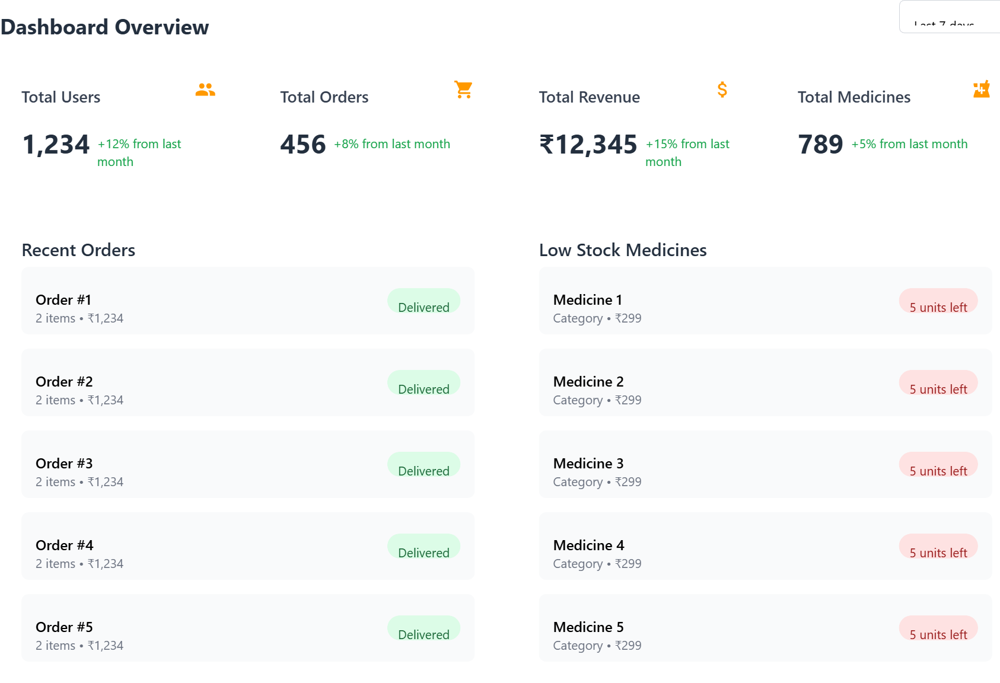
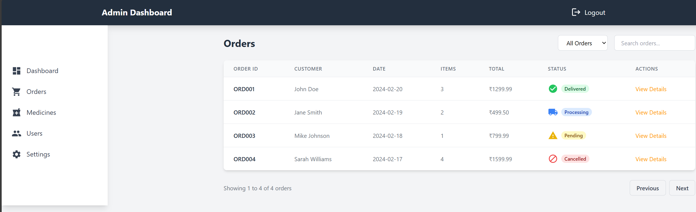
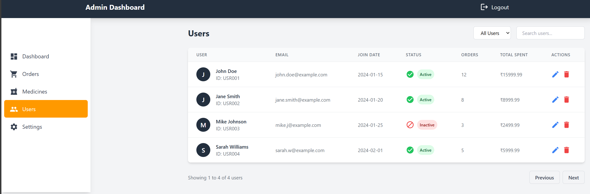

# PMS Admin Interface

A modern, responsive admin interface for the Pharmacy Management System (PMS) built with React, TypeScript, and Tailwind CSS.

## UI Screenshots

### Dashboard

The dashboard provides a comprehensive overview of the pharmacy's operations with key metrics, recent orders, and stock alerts.

### Orders Management

Track and manage orders with an intuitive interface showing order status, customer details, and delivery information.

### Medicine Inventory

Grid view of medicines with stock levels, pricing, and quick actions for inventory management.

### User Management

Manage users with detailed information about their orders, status, and account details.

### Settings

Configure system settings including store information, notifications, security, and more.

## Features

### Dashboard
- Overview of key metrics and statistics
- Recent activity tracking
- Quick access to important functions
- Real-time updates and notifications

### Orders Management
- Comprehensive order tracking system
- Status management (Delivered, Processing, Cancelled, Pending)
- Order details with customer information
- Filtering and search capabilities
- Pagination for large datasets

### Medicine Inventory
- Grid view of all medicines with images
- Stock level monitoring with visual indicators
- Quick edit and delete functionality
- Category-based filtering
- Search functionality
- Add new medicines interface

### User Management
- Complete user overview with status indicators
- Order history and spending tracking
- User status management (Active/Inactive)
- Quick actions for user administration
- Search and filter capabilities

### Settings
- Store configuration
  - Basic information (name, address, contact)
  - Operational settings
- Notification preferences
  - Email notifications
  - Order updates
  - Stock alerts
- Security settings
  - Two-factor authentication
  - Session management
- Payment configuration
  - Currency settings
  - Payment method management
- Email settings
  - Template management
  - Email configuration
- Localization
  - Language selection
  - Timezone settings

## Technology Stack

- **Frontend Framework**: React with TypeScript
- **Styling**: Tailwind CSS
- **Icons**: Material-UI Icons
- **Routing**: React Router v6
- **State Management**: React Hooks
- **Design System**: Amazon-inspired UI components

## Getting Started

1. Clone the repository:
\`\`\`bash
git clone <repository-url>
cd pms/frontend/admin
\`\`\`

2. Install dependencies:
\`\`\`bash
npm install
\`\`\`

3. Start the development server:
\`\`\`bash
npm start
\`\`\`

The application will be available at [http://localhost:3000](http://localhost:3000).

## Available Scripts

### `npm start`
Runs the app in development mode.

### `npm test`
Launches the test runner.

### `npm run build`
Builds the app for production.

### `npm run lint`
Runs the linter to check for code style issues.

## Project Structure

\`\`\`
src/
├── components/     # Reusable UI components
├── pages/         # Main application pages
│   ├── Dashboard.tsx
│   ├── Orders.tsx
│   ├── Medicines.tsx
│   ├── Users.tsx
│   └── Settings.tsx
├── styles/        # Global styles and Tailwind configuration
├── utils/         # Utility functions and helpers
└── App.tsx        # Main application component
\`\`\`

## Design System

The interface follows Amazon's design principles with a custom color scheme:
- Primary Blue: #232f3e
- Accent Orange: #ff9900
- Modern, clean UI components
- Responsive design for all screen sizes
- Consistent spacing and typography

## TODO

- [ ] Implement API integration
- [ ] Add real-time notifications
- [ ] Implement user authentication
- [ ] Add form validation
- [ ] Implement error handling
- [ ] Add data export functionality
- [ ] Implement advanced search features
- [ ] Add batch operations for inventory
- [ ] Implement detailed analytics
- [ ] Add print functionality for orders

## Contributing

1. Fork the repository
2. Create your feature branch: `git checkout -b feature/my-new-feature`
3. Commit your changes: `git commit -am 'Add some feature'`
4. Push to the branch: `git push origin feature/my-new-feature`
5. Submit a pull request

## License

This project is licensed under the MIT License - see the LICENSE file for details.
